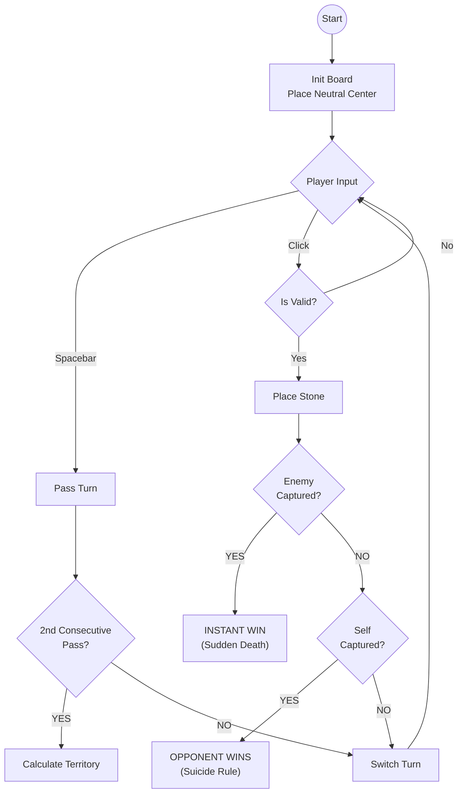

# Great Kingdom (C# / Raylib)

**Great Kingdom** is a strategic territory-building game where a single captured stone results in immediate defeat ("Sudden Death"). This project is a C# implementation using **Raylib** for hardware-accelerated 2D graphics, specifically configured for Windows and WSL2 (Linux) environments.


---

## Demo

[Demo](Resources/Demo2.gif)

## Build & Run Instructions

### Prerequisites
* **.NET 8.0 SDK**
* **TorchSharp**: Neural network library (automatically installed via NuGet)
* **TorchSharp-cpu**: CPU-based PyTorch backend (automatically installed via NuGet)
* **Raylib-cs**: Hardware-accelerated graphics library (automatically installed via NuGet)
* **WSL2 / Linux Users:** You must install the underlying graphics and PyTorch dependencies.

### Install System Dependencies (WSL2 / Ubuntu)
*If you are on Windows (native), skip this step.*

```bash
sudo apt-get update
sudo apt-get install -y dotnet-sdk-8.0

# Raylib dependencies (windowing/input):
sudo apt-get install -y libasound2-dev libx11-dev libxrandr-dev libxi-dev \
libgl1-mesa-dev libglu1-mesa-dev libxcursor-dev libxinerama-dev libwayland-dev libxkbcommon-dev

# TorchSharp/LibTorch dependencies:
sudo apt-get install -y libgomp1
```

### Build the Game
Open your terminal in the **ProjectRoot** folder.

```bash
# 1. Restore NuGet packages (downloads Raylib-cs)
dotnet restore

# 2. Run the game
# Note: We point to the project folder explicitly
dotnet run --project GreatKingdom
```

---

## Game Rules

Great Kingdom combines the territory mechanics of *Go* with a "Sudden Death" rule.

See also [Rules](Rules.md).

### Core Mechanics
1.  **Objective:** Win via **Capture** (Sudden Death) or **Territory Scoring**.
2.  **Turn Order:** **Blue** moves first. **Orange** moves second.
3.  **The Board:** 9x9 Grid.
4.  **Neutral Castle:** A grey stone begins in the exact center (*Tengen*). It belongs to neither player but acts as a wall for territory.

### Victory Condition A: Sudden Death (Capture)
If you place a stone that removes the last liberty (adjacent empty space) of an enemy stone or group, **you win immediately**.
* **Double KO:** If a move surrounds *both* your stone and the opponent's stone, the **Active Player** (the one who moved) wins.
* **Suicide:** You cannot place a stone that has no liberties unless it captures the enemy. If you commit suicide without capturing, you lose.

### Victory Condition B: Territory Scoring
If both players **Pass** consecutively, the game ends. Players count the empty intersections fully enclosed by their stones.
* **Walls:** Board edges and the Neutral Castle count as walls.
* **The 4-Edge Rule:** A territory cannot touch **all four edges** of the board simultaneously.
* **Handicap:** Because Blue goes first, **Blue must win by 3 points**.
    * If `Blue Score >= Orange Score + 3`: **Blue Wins**.
    * Otherwise: **Orange Wins**.

---

## AI & Training

Great Kingdom includes a Deep Q-Network (DQN) AI that learns to play through self-training. The system is designed to work out-of-the-box with a default brain, while also providing powerful tools for users who wish to train stronger models.

### How to Use and Train the AI

The repository uses a simple and robust strategy for managing AI models ("brains") within the `GreatKingdom/brains/` directory:

1.  **Out-of-the-Box Play**: The game comes with `brain_default.bin`, a single, untrained model. On first launch or when no other brains are present, the game loads this brain, allowing you to immediately play against a functional AI by selecting **"VS Neural Net"**.

2.  **Initial Training (vs. MCTS)**: To create stronger brains, go to the main menu and select **"Train Neural Net"**. In this mode, the AI plays against a traditional MCTS opponent. As it improves, it saves new brains with filenames like `brain_L005843_G12345_....bin`.

3.  **Advanced Training (Brain vs. Brain)**: Once you have generated at least two brains, select **"Brain vs. Brain"** from the main menu. The system automatically loads the two best-performing brains and has them play against each other in a continuous self-training loop. This self-competition rapidly accelerates the AI's skill.

4.  **Using Your Trained AI**: When you stop the "Brain vs. Brain" session (by pressing `ESC`), the champion brain is automatically saved as `latest.bin`. The game will now automatically load this superior brain whenever you select **"VS Neural Net"** from the main menu.

#### How to Create Your First Models for Self-Training

The powerful "Brain vs. Brain" training mode requires at least two different brain files to compare. Here is how to create them:

1.  **Start the Initial Training:** From the main menu, select **"Train Neural Net"**. You will see a live view of the AI playing against the MCTS opponent.
2.  **Save the First Brain:** Wait for the "Games Played" counter to reach a milestone (e.g., 50 or 100 games). Press the **"Save Brain"** button. A new `brain_L..._G....bin` file is now saved.
3.  **Let the AI Improve:** Allow the training to continue for another 50-100 games. The AI's "Current Loss" should decrease, showing that it is learning.
4.  **Save the Second Brain:** Press the **"Save Brain"** button again. You now have a second, slightly stronger brain file.
5.  **Begin Self-Training:** You can now exit (press `ESC`) and start the **"Brain vs. Brain"** mode. The system will automatically pick your two newly saved brains and begin the advanced self-training process.

### Brain Storage & Filename Format

Trained neural networks are stored in the `GreatKingdom/brains/` directory.

**Filename Format:**
```
brain_L{loss}_G{games}_{timestamp}.bin
```

**Example:**
```
brain_L005843_G12345_20251202_143000.bin
  |      |      |         |
  |      |      |         └─ Timestamp (YYYYMMDD_HHMMSS)
  |      |      └─────────── Games played (12,345)
  |      └────────────────── Loss value * 1,000,000 (0.005843)
  └───────────────────────── Identifier prefix
```

**Special Files:**
* `brain_default.bin` - The default, untrained brain included in the repo (tracked by Git LFS).
* `latest.bin` - An alias for the best brain from a training session. This file is ignored by Git, as it is a dynamically generated copy of the current best model.

### AI Architecture & Algorithm

*   **Model**: The neural network is a fully-connected feedforward network built with TorchSharp.
    ```
    Input Layer:  81 nodes (9x9 board state)
    Hidden Layer: 256 nodes (ReLU activation)
    Hidden Layer: 256 nodes (ReLU activation)
    Output Layer: 81 nodes (Q-values for each board position)
    ```
*   **Input Encoding**: The 9x9 board is flattened into a vector with the following values:
    *   `1.0` = Your stones
    *   `-1.0` = Opponent stones
    *   `0.1` = Neutral castle
    *   `0.0` = Empty space
*   **Training Algorithm**: The AI uses **Deep Q-Learning (DQN)** with experience replay and a target network to stabilize learning.
    *   **Opponent**: During initial "Train Neural Net" mode, the AI plays against a **Monte Carlo Tree Search (MCTS)** algorithm with configurable iterations.
*   **Reward Shaping**: To guide learning, the AI receives small rewards or penalties during the game, in addition to the final win/loss signal.
    *   **Shaped Rewards**: Captures (+0.3/stone), losses (-0.5/stone)
    *   **Terminal Rewards**: Win (+1.0), Loss (-1.0)

### Configuration & Hyperparameters (`config.json`)

The game uses `config.json` for runtime configuration. This file is located at the project root (`CsharpGreatKingdom/config.json`) and is automatically loaded on startup.

**Configuration Structure:**
```json
{
  "Game": {
    "GridSize": 9,
    "MCTSIterations": 1000,
    "DefaultIP": "127.0.0.1",
    "Port": 7777
  },
  "AI": {
    "Hyperparameters": {
      "LearningRate": 0.0005,
      "Gamma": 0.95,
      "BatchSize": 128
    },
    "Exploration": {
      "EpsilonStart": 1.0,
      "EpsilonMin": 0.05,
      "EpsilonDecay": 0.9995
    },
    "Memory": {
      "Capacity": 10000,
      "TargetUpdateFrequency": 500
    }
  }
}
```

#### Settings Explained

**Game Settings:**
| Parameter | Default | Description |
|-----------|---------|-------------|
| `GridSize` | 9 | Board dimensions (9x9 grid) |
| `MCTSIterations` | 1000 | Number of MCTS simulations for AI opponent (higher = stronger but slower) |
| `DefaultIP` | "127.0.0.1" | Default IP address for network games |
| `Port` | 7777 | Network port for multiplayer games |

**AI Hyperparameters:**
| Parameter | Default | Description |
|-----------|---------|-------------|
| `LearningRate` | 0.0005 | Neural network learning rate (lower = slower but more stable) |
| `Gamma` | 0.95 | Discount factor for future rewards (0.0-1.0, higher = more long-term thinking) |
| `BatchSize` | 128 | Number of experiences sampled per training iteration |

**AI Exploration:**
| Parameter | Default | Description |
|-----------|---------|-------------|
| `EpsilonStart` | 1.0 | Initial exploration rate (1.0 = 100% random moves at start) |
| `EpsilonMin` | 0.05 | Minimum exploration rate (always explore 5% to avoid local optima) |
| `EpsilonDecay` | 0.9995 | Exploration decay multiplier per game (closer to 1.0 = slower decay) |

**AI Memory:**
| Parameter | Default | Description |
|-----------|---------|-------------|
| `Capacity` | 10000 | Experience replay buffer size (more = better diversity, more RAM) |
| `TargetUpdateFrequency` | 500 | Update target network every N training steps (stabilizes learning) |

#### Tuning Tips

**For Faster Training:**
* Increase `LearningRate` to 0.001-0.005
* Decrease `MCTSIterations` to 500-800
* Increase `EpsilonDecay` to 0.999

**For Better Final Performance:**
* Decrease `LearningRate` to 0.0001-0.0003
* Increase `MCTSIterations` to 1500-3000
* Increase `Capacity` to 20000-50000

**If Training is Unstable:**
* Decrease `LearningRate`
* Increase `Gamma` (0.95-0.99)
* Decrease `EpsilonDecay` (slower exploration reduction)


---

## Logic & Diagrams

### Game Loop Architecture
The State Machine handles the "Instant Win" checks immediately after placement.



### Territory Validation Algorithm (Flood Fill)
This logic determines if an empty area counts as points, is disputed, or is invalid.


---

## Controls

| Key | Action |
| :--- | :--- |
| **Left Mouse** | Place Stone |
| **Spacebar** | Pass Turn |
| **R** | Reset Game |
| **ESC** | Exit |

---

## Acknowledgements
The primary source material for the rules and mechanics implemented in this project is the official tutorial video by KBG Publishing.

Video Title: GREAT KINGDOM - How to Play

Publisher: KBG Publishing (Wiz Stone Series)

Link: https://www.youtube.com/watch?v=LcARX2S7a0c

The game is part of the Wiz Stone board game series, designed by professional Go player Lee Sedol.