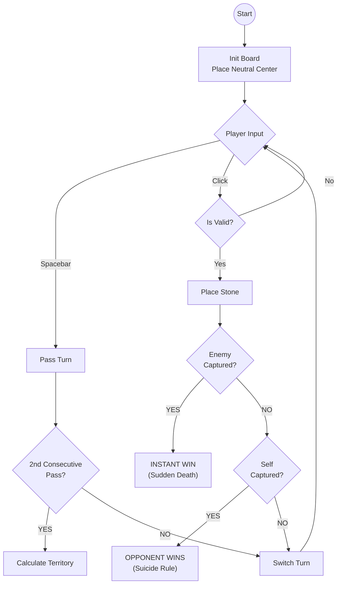
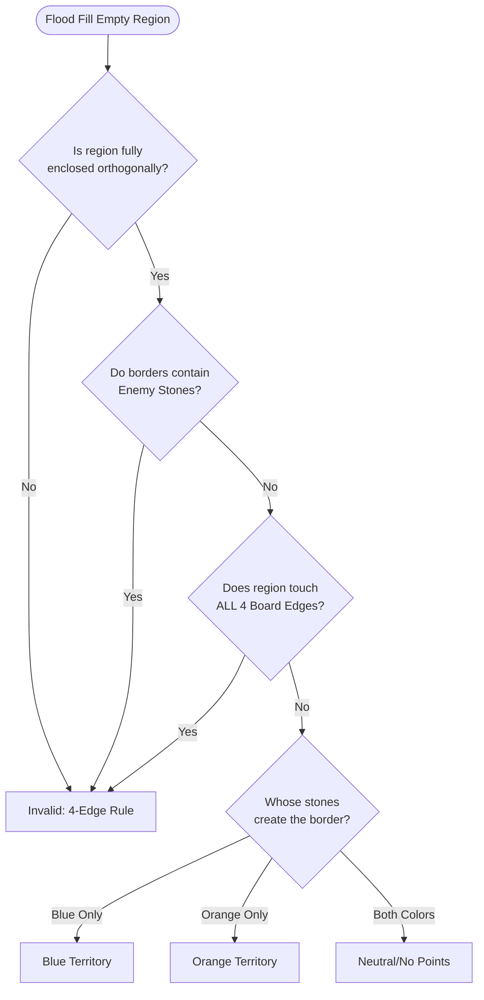

# Great Kingdom (C# / Raylib)

**Great Kingdom** is a strategic territory-building game where a single captured stone results in immediate defeat ("Sudden Death"). This project is a C# implementation using **Raylib** for hardware-accelerated 2D graphics, specifically configured for Windows and WSL2 (Linux) environments.


---

## 1. Project Structure

To build successfully, ensure your folder structure is exactly as follows:

```text
ProjectRoot/
├── GreatKingdom.sln          # Solution File
├── README.md                 # This file
└── GreatKingdom/             # Source Code Folder
    ├── GreatKingdom.csproj   # Project Settings (References Raylib-cs)
    └── Program.cs            # Main Game Logic (See "Source Code" section below)
```

---

## 2. Build & Run Instructions

### Prerequisites
* **.NET 8.0 SDK**
* **WSL2 / Linux Users:** You must install the underlying graphics libraries.

### Step 1: Install System Dependencies (WSL2 / Ubuntu)
*If you are on Windows (native), skip this step.*

```bash
sudo apt-get update
sudo apt-get install -y dotnet-sdk-8.0
# Raylib requires these for windowing/input:
sudo apt-get install -y libasound2-dev libx11-dev libxrandr-dev libxi-dev \
libgl1-mesa-dev libglu1-mesa-dev libxcursor-dev libxinerama-dev libwayland-dev libxkbcommon-dev
```

### Step 2: Build the Game
Open your terminal in the **ProjectRoot** folder.

```bash
# 1. Restore NuGet packages (downloads Raylib-cs)
dotnet restore

# 2. Run the game
# Note: We point to the project folder explicitly
dotnet run --project GreatKingdom
```

---

## Game Rules

Great Kingdom combines the territory mechanics of *Go* with a "Sudden Death" rule.

See also (Rules.md)[Rules].

### Core Mechanics
1.  **Objective:** Win via **Capture** (Sudden Death) or **Territory Scoring**.
2.  **Turn Order:** **Blue** moves first. **Orange** moves second.
3.  **The Board:** 9x9 Grid.
4.  **Neutral Castle:** A grey stone begins in the exact center (*Tengen*). It belongs to neither player but acts as a wall for territory.

### Victory Condition A: Sudden Death (Capture)
If you place a stone that removes the last liberty (adjacent empty space) of an enemy stone or group, **you win immediately**.
* **Double KO:** If a move surrounds *both* your stone and the opponent's stone, the **Active Player** (the one who moved) wins.
* **Suicide:** You cannot place a stone that has no liberties unless it captures the enemy. If you commit suicide without capturing, you lose.

### Victory Condition B: Territory Scoring
If both players **Pass** consecutively, the game ends. Players count the empty intersections fully enclosed by their stones.
* **Walls:** Board edges and the Neutral Castle count as walls.
* **The 4-Edge Rule:** A territory cannot touch **all four edges** of the board simultaneously.
* **Handicap:** Because Blue goes first, **Blue must win by 3 points**.
    * If `Blue Score >= Orange Score + 3`: **Blue Wins**.
    * Otherwise: **Orange Wins**.

---

## Logic & Diagrams

### Game Loop Architecture
The State Machine handles the "Instant Win" checks immediately after placement.



### Territory Validation Algorithm (Flood Fill)
This logic determines if an empty area counts as points, is disputed, or is invalid.



---

## Controls

| Key | Action |
| :--- | :--- |
| **Left Mouse** | Place Stone |
| **Spacebar** | Pass Turn |
| **R** | Reset Game |
| **ESC** | Exit |

---

## Acknowledgements
The primary source material for the rules and mechanics implemented in this project is the official tutorial video by KBG Publishing.

Video Title: GREAT KINGDOM - How to Play

Publisher: KBG Publishing (Wiz Stone Series)

Link: https://www.youtube.com/watch?v=LcARX2S7a0c

The game is part of the Wiz Stone board game series, designed by professional Go player Lee Sedol.
