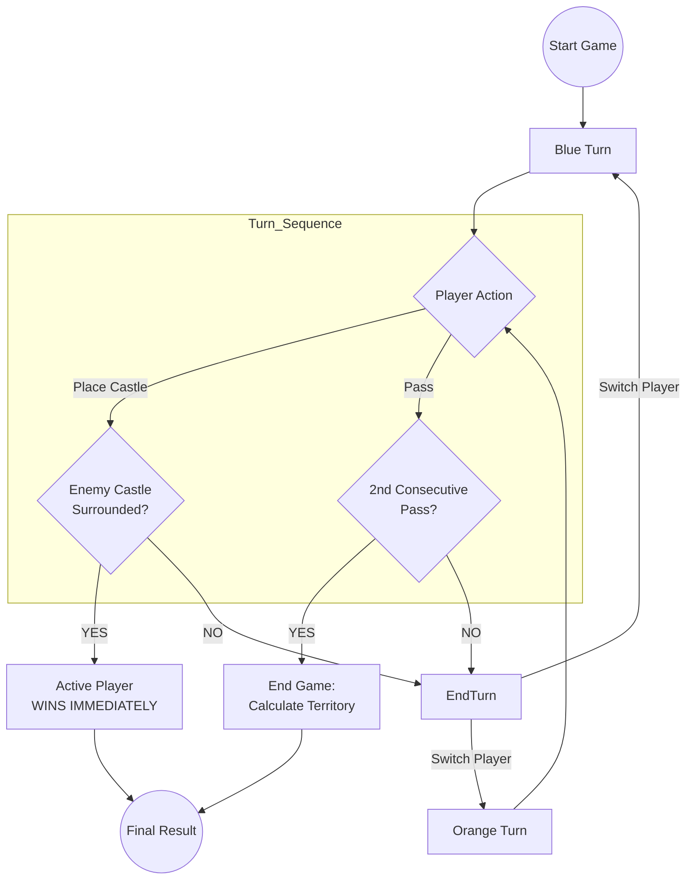
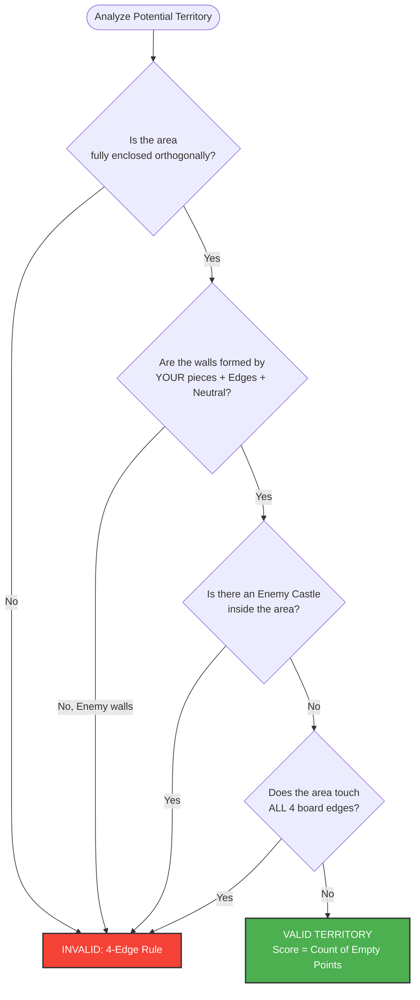
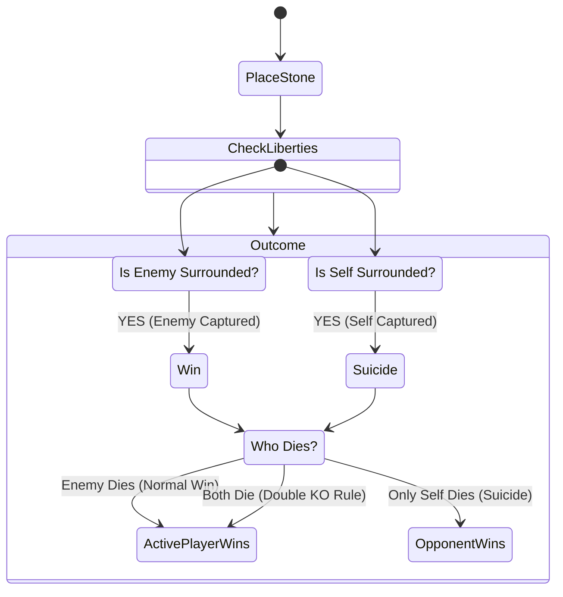
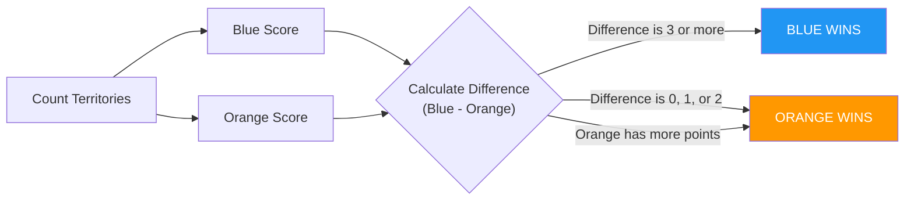

# Great Kingdom: Official Rulebook

**Great Kingdom** is a strategic abstract strategy game from the *Wiz Stone* series. It combines territory control mechanics with a "sudden death" capture rule.

---

## Game Overview

* **Players:** 2 (Blue vs. Orange).
* **Board:** 9x9 Grid (typically).
* **Objective:** Achieve victory through **Sudden Death** (capturing an enemy castle) or **Territory Scoring** (controlling the most land).

---

## Components & Setup

1.  **The Neutral Castle:** Place the grey Neutral Castle on the center intersection of the board (*Tengen*). This piece acts as a permanent, indestructible wall for both players.
2.  **Player Pieces:**
    * Player 1 takes **Blue Castles**.
    * Player 2 takes **Orange Castles**.
3.  **First Turn:** Blue always moves first.

---

## Gameplay Loop

Players alternate turns placing one castle at a time. The game continues until a capture occurs or both players pass consecutively.

**Turn Sequence:**
1. Current player chooses to either **Place a Castle** or **Pass**
2. If placing: Check if any enemy castle is captured
3. If both players pass consecutively: Calculate territory scores
4. Switch turns and repeat

---

## Territory Rules

Territory is defined as empty intersections surrounded by a player's castles.

### Definition of Enclosure
* **Orthogonal Only:** Connections must be Up, Down, Left, or Right. Diagonals do not count.
* **Walls:** You may use the **Board Edges** and the **Neutral Castle** as walls to complete an enclosure.

### Invalid Territory
* **Invasion:** If an opponent's castle is inside the area, it is **not** territory.
* **The 4-Edge Rule:** A territory cannot touch all four edges of the board simultaneously.

### Territory Validation Logic

The following flowchart describes how the game validates whether an empty area counts as valid territory:

---

## Sudden Death (The Capture Rule)

Unlike traditional Go, **capturing a piece ends the game immediately.**

* **Surrounding:** A castle is surrounded when it has no orthogonal liberties (empty adjacent spots).
* **Double KO:** If placing a stone surrounds BOTH your stone and the opponent's stone simultaneously, the **Active Player** (the one who placed the stone) wins.

---

## Scoring (The Handicap)

If no captures occur, the game ends when both players pass consecutively.

### The First-Move Advantage

* **Blue Handicap:** Because Blue moves first, they have an advantage. To balance this, Blue must win by **3 or more points**.
* **Orange Advantage:** Orange wins ties and narrow losses (differences of 1 or 2 points).

### Winning Criteria

1. Count empty spaces in Blue Territory (B)
2. Count empty spaces in Orange Territory (O)
3. Calculate the difference: `B - O`
4. Apply handicap rule:
   * If `B >= O + 3` then **Blue Wins**
   * Otherwise **Orange Wins**

---

## Quick Reference

**Victory Conditions:**
* **Sudden Death**: Capture any enemy castle = Instant Win
* **Territory Scoring**: Control more territory (Blue needs +3 advantage)

**Key Rules:**
* **Board**: 9x9 grid with neutral castle in center
* **Turn Order**: Blue moves first
* **Placement**: One castle per turn on empty intersections
* **Liberties**: Orthogonal connections only (not diagonal)
* **Double KO**: Active player wins if both stones die
* **Suicide**: Illegal unless it captures enemy
* **Territory**: Must be fully enclosed, cannot touch all 4 edges
* **Passing**: Both players pass = Game ends, count territory
* **Blue Handicap**: Blue must win by 3+ points (first-move advantage)

---

For implementation details, AI system, and build instructions, see the [Main README](Readme.md).
