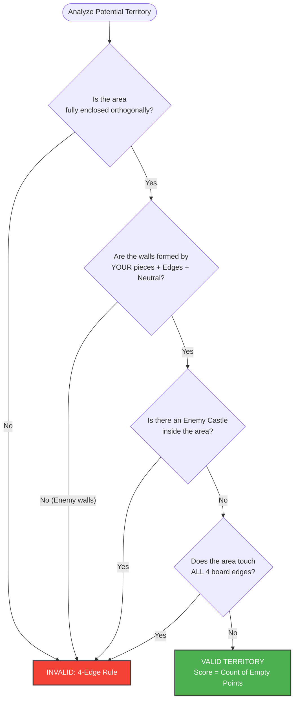

# Great Kingdom: Official Rulebook

**Great Kingdom** is a strategic abstract strategy game from the *Wiz Stone* series. It combines territory control mechanics with a "sudden death" capture rule.

---

## 1. Game Overview

* **Players:** 2 (Blue vs. Orange).
* **Board:** 9x9 Grid (typically).
* **Objective:** Achieve victory through **Sudden Death** (capturing an enemy castle) or **Territory Scoring** (controlling the most land).

---

## 2. Components & Setup

1.  **The Neutral Castle:** Place the grey Neutral Castle on the center intersection of the board (*Tengen*). This piece acts as a permanent, indestructible wall for both players.
2.  **Player Pieces:**
    * Player 1 takes **Blue Castles**.
    * Player 2 takes **Orange Castles**.
3.  **First Turn:** Blue always moves first.

---

## 3. Gameplay Loop

Players alternate turns placing one castle at a time. The game continues until a capture occurs or both players pass.


---

## 4. Territory Rules

Territory is defined as empty intersections surrounded by a player's castles.

### 4.1. Definition of Enclosure
* **Orthogonal Only:** Connections must be Up, Down, Left, or Right. Diagonals do not count.
* **Walls:** You may use the **Board Edges** and the **Neutral Castle** as walls to complete an enclosure.

### 4.2. Invalid Territory
* **Invasion:** If an opponent's castle is inside the area, it is **not** territory.
* **The 4-Edge Rule:** A territory cannot touch all four edges of the board simultaneously.

### 4.3. Territory Logic Flow



---

## 5. Sudden Death (The Capture Rule)

Unlike traditional Go, **capturing a piece ends the game immediately.**

* **Surrounding:** A castle is surrounded when it has no orthogonal liberties (empty adjacent spots).
* **Double KO:** If placing a stone surrounds BOTH your stone and the opponent's stone simultaneously, the **Active Player** (the one who placed the stone) wins.


---

## 6. Scoring (The Handicap)

If no captures occur, the game ends when both players pass.

* **Blue Handicap:** Because Blue moves first, they have an advantage. To balance this, Blue must win by **3 or more points**.
* **Orange Advantage:** Orange wins ties and narrow losses (1 or 2 points).

**Winning Criteria:**
1.  Count empty spaces in Blue Territory ($B$).
2.  Count empty spaces in Orange Territory ($O$).
3.  Check: Is $B \ge O + 3$?

```mermaid
graph LR
    Count[Count Territories] --> B[Blue Score]
    Count --> O[Orange Score]
    
    B & O --> Compare{Calculate Difference<br/>(Blue - Orange)}
    
    Compare -- Difference is 3 or more --> BlueWin[BLUE WINS]
    Compare -- Difference is 0, 1, or 2 --> OrangeWin[ORANGE WINS]
    Compare -- Orange has more points --> OrangeWin
    
    style BlueWin fill:#2196F3,color:white
    style OrangeWin fill:#FF9800,color:white
```
